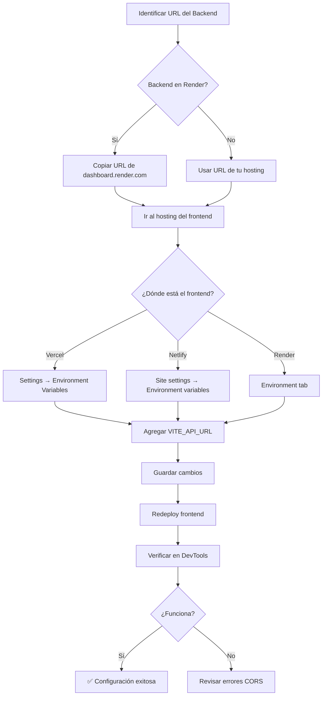

# ⚠️ Configuración de Producción - URGENTE

## 🚨 Problema Actual

El frontend está intentando conectarse a `decano-astrologico.onrender.com` pero este dominio **NO EXISTE** o **NO RESUELVE**.

**Error en consola:**
```
Failed to load resource: net::ERR_NAME_NOT_RESOLVED
decano-astrologico.onrender.com/reports/generation-status/...
```

**Causa:** La variable de entorno `VITE_API_URL` NO está configurada en tu plataforma de hosting del frontend.

---

## ✅ Solución Rápida (5 minutos)

### Paso 1: Identificar la URL Real del Backend

**¿Dónde está desplegado tu backend?**

Si usas Render, la URL del backend será algo como:
```
https://nombre-del-servicio.onrender.com
```

Por ejemplo:
- `https://decano-backend.onrender.com`
- `https://decano-api-xyz123.onrender.com`

**Cómo encontrarla en Render:**
1. Ve a https://dashboard.render.com
2. Haz clic en tu servicio backend (FastAPI)
3. Copia la URL que aparece en la parte superior (ej: `https://tu-servicio.onrender.com`)

---

### Paso 2: Configurar Variable de Entorno en el Frontend

Dependiendo de dónde esté desplegado tu frontend, sigue las instrucciones correspondientes:

---

## 🟦 Si usas VERCEL

1. Ve a https://vercel.com/dashboard
2. Selecciona tu proyecto frontend
3. Ve a **Settings** → **Environment Variables**
4. Haz clic en **Add New**
5. Configura:
   ```
   Name: VITE_API_URL
   Value: https://TU-BACKEND.onrender.com
   ```
   (Reemplaza `TU-BACKEND` por la URL real de tu backend)
6. Selecciona: **Production**, **Preview**, **Development**
7. Haz clic en **Save**
8. **IMPORTANTE:** Redeploy el frontend:
   - Ve a **Deployments**
   - Haz clic en los 3 puntos del deployment más reciente
   - Selecciona **Redeploy**

---

## 🟩 Si usas NETLIFY

1. Ve a https://app.netlify.com
2. Selecciona tu proyecto
3. Ve a **Site settings** → **Environment variables**
4. Haz clic en **Add a variable**
5. Configura:
   ```
   Key: VITE_API_URL
   Value: https://TU-BACKEND.onrender.com
   ```
6. Haz clic en **Save**
7. **IMPORTANTE:** Trigger un redeploy:
   - Ve a **Deploys**
   - Haz clic en **Trigger deploy** → **Deploy site**

---

## 🟪 Si usas RENDER (Frontend también en Render)

1. Ve a https://dashboard.render.com
2. Selecciona tu servicio **frontend** (Static Site o Web Service)
3. Ve a **Environment**
4. Haz clic en **Add Environment Variable**
5. Configura:
   ```
   Key: VITE_API_URL
   Value: https://TU-BACKEND.onrender.com
   ```
6. Haz clic en **Save Changes**
7. Render automáticamente hará redeploy

---

## 🔍 Verificar la Configuración

### Opción A: Inspeccionar desde DevTools

1. Abre tu aplicación en producción
2. Abre DevTools (F12)
3. Ve a la pestaña **Console**
4. Escribe: `import.meta.env.VITE_API_URL`
5. Debería mostrar tu URL del backend (NO `undefined`)

### Opción B: Ver en Network

1. Abre DevTools → **Network**
2. Intenta generar un informe
3. Busca la petición a `/reports/start-full-generation`
4. Verifica que la URL sea correcta (tu backend real)

---

## 🎯 Checklist de Verificación

- [ ] **Backend funcionando:** Ve a `https://TU-BACKEND.onrender.com/docs` - debería mostrar Swagger UI
- [ ] **Variable configurada:** `VITE_API_URL` agregada en el dashboard de hosting
- [ ] **Frontend redeployado:** Después de agregar la variable
- [ ] **URL correcta:** Sin barra final (❌ `...com/` ✅ `...com`)
- [ ] **HTTPS:** Debe ser HTTPS, no HTTP
- [ ] **CORS configurado:** El backend debe permitir peticiones desde tu dominio frontend

---

## ⚠️ Errores Comunes

### ❌ Error 1: "Cannot GET /"
**Problema:** La URL del backend termina en `/`

**Solución:** Remover la barra final:
```bash
# ❌ MAL
VITE_API_URL=https://tu-backend.onrender.com/

# ✅ BIEN
VITE_API_URL=https://tu-backend.onrender.com
```

---

### ❌ Error 2: "CORS policy blocked"
**Problema:** El backend no permite peticiones desde tu dominio frontend

**Solución:** Verificar configuración CORS en el backend:

```python
# backend/main.py
app.add_middleware(
    CORSMiddleware,
    allow_origins=[
        "https://tu-frontend.vercel.app",  # ✅ Agregar tu dominio
        "http://localhost:5173"
    ],
    allow_credentials=True,
    allow_methods=["*"],
    allow_headers=["*"],
)
```

---

### ❌ Error 3: "net::ERR_NAME_NOT_RESOLVED"
**Problema:** La URL del backend es incorrecta o el servicio está caído

**Solución:**
1. Verifica que el backend esté activo en Render
2. Prueba abrir la URL directamente en el navegador: `https://TU-BACKEND.onrender.com/docs`
3. Si no carga, el backend está caído o la URL es incorrecta

---

## 🔄 Flujo Completo de Configuración



---

## 📋 Valores de Ejemplo

```bash
# Producción
VITE_API_URL=https://decano-backend.onrender.com

# Staging (si tienes)
VITE_API_URL=https://decano-backend-staging.onrender.com

# Local (desarrollo)
VITE_API_URL=http://localhost:8000
```

---

## 🚀 Después de Configurar

Una vez configurada la variable:

1. ✅ Los informes se generarán correctamente
2. ✅ No más errores "Failed to fetch"
3. ✅ El stall detection funcionará correctamente (fix anterior)
4. ✅ El formato UX/UI se aplicará al contenido generado

---

## 📞 ¿Necesitas Ayuda?

Si después de seguir estos pasos aún tienes problemas:

1. **Verifica el backend está activo:**
   - Abre `https://TU-BACKEND.onrender.com/docs` en el navegador
   - Debería mostrar la documentación de FastAPI (Swagger UI)

2. **Comparte el valor de la variable:**
   - En DevTools Console escribe: `import.meta.env.VITE_API_URL`
   - Comparte el resultado

3. **Comparte el error completo:**
   - DevTools → Console → captura el error completo

---

## 🔑 Resumen Rápido (TL;DR)

```bash
# 1. Encuentra la URL del backend
https://TU-BACKEND.onrender.com

# 2. Configura variable en hosting del frontend
VITE_API_URL=https://TU-BACKEND.onrender.com

# 3. Redeploy el frontend

# 4. Verifica en DevTools que import.meta.env.VITE_API_URL tiene el valor correcto

# 5. Genera un informe de prueba
```

---

**Tiempo estimado:** 5-10 minutos
**Dificultad:** Fácil
**Impacto:** CRÍTICO - sin esto, NADA funciona

**Última actualización:** 2026-01-12
